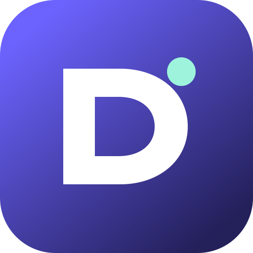

# DeepSeek Harness Desktop

<p align="center">
  
</p>

<p align="center">DeepSeek Harness in a downloadable, launchable macOS and Windows desktop window.</p>

<p align="center">
  <a href="https://github.com/k4its1t/deepseek-harness-desktop-community/actions/workflows/build.yml"></a>
  <a href="https://github.com/k4its1t/deepseek-harness-desktop-community/releases/latest"></a>
  <a href="https://github.com/k4its1t/deepseek-harness-desktop-community/releases"></a>
  <a href="LICENSE"></a>
</p>

[中文](README.zh.md)

An unofficial, minimal, open-source desktop shell for the official [DeepSeek Harness](https://github.com/deepseek-ai/deepseek-harness) Web UI on macOS and Windows.

The app starts the pinned `@deepseek-ai/dsh` runtime as a private child process, binds it to a random loopback port, and displays the official Web UI in a sandboxed Electron window. End users do not need to install Node.js or `dsh` separately.

> This community project is not an official DeepSeek product and is not affiliated with or endorsed by DeepSeek.

## Why this project exists

DeepSeek Harness already provides the Web UI and agent runtime, but a command-line installation, Node.js environment, and background process can be unnecessary friction for desktop users. This project does not reimplement Harness. It packages a pinned official runtime inside Electron so new users can launch from an installer while existing CLI users keep their configuration, sessions, and workspaces.

It is intended for:

- people who want DeepSeek Harness in a dedicated macOS or Windows window;
- users who do not want to maintain Node.js, the `dsh` command, and a launch script separately;
- existing CLI users who want to reuse their `~/.dsh` data;
- developers willing to test community builds on different hardware.

## Direct downloads

| Platform | Download |
| --- | --- |
| macOS Apple Silicon (M1/M2/M3/M4) | [Download DMG](https://github.com/k4its1t/deepseek-harness-desktop-community/releases/latest/download/DeepSeek-Harness-Desktop-mac-arm64.dmg) |
| macOS Intel | [Download DMG](https://github.com/k4its1t/deepseek-harness-desktop-community/releases/latest/download/DeepSeek-Harness-Desktop-mac-x64.dmg) |
| Windows x64 installer | [Download setup](https://github.com/k4its1t/deepseek-harness-desktop-community/releases/latest/download/DeepSeek-Harness-Desktop-win-x64.exe) |
| Windows x64 portable | [Download portable ZIP](https://github.com/k4its1t/deepseek-harness-desktop-community/releases/latest/download/DeepSeek-Harness-Desktop-win-x64.zip) |
| All 3 companion skills | [Download skills ZIP](https://github.com/k4its1t/deepseek-harness-desktop-community/releases/latest/download/DeepSeek-Harness-Desktop-Skills.zip) |

[View the latest release notes and SHA-256 checksums](https://github.com/k4its1t/deepseek-harness-desktop-community/releases/latest). These stable links always resolve to the newest release. Historical release pages remain available and direct visitors here instead of returning a missing-page error. macOS artifacts have a complete ad-hoc integrity signature but are not Apple Developer ID signed or notarized; review the release notes before installing.

## First run

1. Download the package for your operating system and processor. On macOS, check **About This Mac** if you are unsure which architecture you have.
2. Launch the app and complete the standard Harness onboarding flow. The client **does not ship a shared API key**; every user configures their own model provider.
3. Choose **Add Workspace** and select a local project with the in-app directory browser.
4. Create a session and send a task. Existing CLI configuration and history are reused automatically from `~/.dsh`.

If startup fails, open the log folder from the application menu and run the bundled `/diagnose-harness-desktop` read-only workflow. Remove API keys, usernames, private paths, and project content before posting a public issue.

## Features

- Official DeepSeek Harness Web UI and agent runtime
- macOS and Windows installers
- Existing `~/.dsh` settings, credentials, sessions, and profiles
- Random `127.0.0.1` port; no LAN exposure
- Sandboxed renderer with Node integration disabled
- Cross-platform in-app directory browser for the same workspace flow on macOS and Windows
- Automatic child-process shutdown when the desktop app quits
- Bundled diagnosis and privacy-safe bug-report skills

## Companion skills

The desktop app bundles two optional skills from `.dsh/skills` and makes them available automatically:

- `/diagnose-harness-desktop` safely performs read-only diagnosis of desktop startup, API, session, profile, tool, permission, and packaging problems.
- `/prepare-harness-bug-report` turns diagnostic evidence into a sanitized, reproducible GitHub issue draft.

DeepSeek Harness also discovers the source copies automatically when this repository is the current workspace. To use them with other Harness installations, copy them to the default user skill directory:

```bash
# macOS
mkdir -p "$HOME/.dsh/skills"
cp -R .dsh/skills/* "$HOME/.dsh/skills/"
```

```powershell
# Windows PowerShell
New-Item -ItemType Directory -Force "$HOME\.dsh\skills"
Copy-Item -Recurse -Force .dsh\skills\* "$HOME\.dsh\skills\"
```

The skills do not read or expose API keys by default and will not send test requests, change configuration, or submit GitHub issues without explicit user approval. `npm test` validates their discovery and metadata with the pinned DeepSeek Harness parser.

### Standalone local image-analysis skill

`/analyze-images-locally` bridges a user-approved local image through an installed Ollama vision model, then lets the active text-only DeepSeek model reason over structured observations. It supports screenshots, photos, scanned documents, charts, and diagrams; a local Tesseract installation provides an OCR-only fallback.

[Download the latest complete companion Skill ZIP](https://github.com/k4its1t/deepseek-harness-desktop-community/releases/latest/download/DeepSeek-Harness-Desktop-Skills.zip). Extract only its `analyze-images-locally` folder into `~/.dsh/skills`, restart Harness, and invoke it with a local image path. The Skill is not bundled into the desktop installer because the optional Ollama vision model requires a separate multi-gigabyte download. It never installs or downloads that dependency without approval and does not use a cloud vision fallback.

## Release status

| Platform | Artifact | Verification status |
| --- | --- | --- |
| macOS Apple Silicon | DMG / ZIP | First-workspace onboarding, existing API configuration, sessions, and Bash/file-write tools verified in the real desktop window |
| macOS Intel | DMG / ZIP | Built natively by GitHub Actions; final launch verification requires an Intel Mac |
| Windows x64 | NSIS installer / portable ZIP | Uses the same in-app directory browser and is built natively by Windows GitHub Actions; final interactive verification still requires a physical Windows desktop |

The repository intentionally contains no signing certificates. Certificate-free macOS builds receive a complete ad-hoc integrity signature, but Gatekeeper still cannot identify the publisher; first launch may require Finder's **Open** command or **System Settings → Privacy & Security → Open Anyway**. Windows may show a SmartScreen warning. See [macOS signing and first-launch guidance](docs/MACOS_SIGNING.md).

## Scope and known limitations

- This is a community wrapper; it does not provide official DeepSeek support, free API quota, or a hosted service.
- There is currently no built-in updater. Follow [Releases](https://github.com/k4its1t/deepseek-harness-desktop-community/releases/latest) and use the stable links for new builds.
- macOS builds are not Apple Developer ID notarized, and Windows builds do not have a commercial code-signing certificate.
- Apple Silicon has completed an interactive desktop regression; physical Intel Mac and Windows reports are still welcome.
- The local image-analysis skill requires a user-installed Ollama vision model or Tesseract. The desktop app never silently downloads a multi-gigabyte model.

## Install for development

Requirements: Node.js 22 or newer.

```bash
git clone https://github.com/k4its1t/deepseek-harness-desktop-community.git
cd deepseek-harness-desktop-community
npm ci
npm start
```

The first launch uses the standard DeepSeek Harness onboarding flow. Existing CLI users automatically reuse `~/.dsh`. You can override the location by setting `DSH_HOME` before launching the app.

## Test

```bash
npm test
npm run smoke
```

The smoke test launches Electron, starts the bundled Harness runtime, waits for the Web UI to render, prints `DESKTOP_SMOKE_OK`, and exits.

## Build installers

```bash
# Run on macOS
npm run dist:mac

# Run on Windows
npm run dist:win
```

Artifacts are written to `release/`. The GitHub Actions workflow builds macOS x64, macOS arm64, and Windows x64 artifacts and strictly verifies both macOS app signatures. Without credentials, macOS uses a complete ad-hoc signature. Repository maintainers can add Developer ID and notarization secrets without changing the build commands; see [docs/MACOS_SIGNING.md](docs/MACOS_SIGNING.md). Credentials are deliberately never stored in the repository.

The Windows portable ZIP can be extracted and run via `DeepSeek Harness Desktop.exe`. Build the NSIS `.exe` installer on Windows or with the included GitHub Actions workflow.

## Logs and data

Use **File → Open Log Folder** or **File → Open DSH Data Folder**. The wrapper writes lifecycle logs only; DeepSeek Harness owns its normal data under `~/.dsh`.

## Community and feedback

- Questions, ideas, and project showcases: [GitHub Discussions](https://github.com/k4its1t/deepseek-harness-desktop-community/discussions)
- Reproducible problems: [report a bug](https://github.com/k4its1t/deepseek-harness-desktop-community/issues/new?template=bug_report.yml)
- Product ideas: [request a feature](https://github.com/k4its1t/deepseek-harness-desktop-community/issues/new?template=feature_request.yml)
- Physical Intel Mac or Windows results: [submit a compatibility report](https://github.com/k4its1t/deepseek-harness-desktop-community/issues/new?template=compatibility_report.yml)
- If you want to share the project, reuse the [community sharing kit](docs/SHARING.md)
- See [CONTRIBUTING.md](CONTRIBUTING.md) for code contributions and [SECURITY.md](SECURITY.md) for private vulnerability reporting.

## Vibe Coding and contributors

This project was developed using a **Vibe Coding** workflow: the project maintainer defined the goals, supplied the runtime environment, and approved the release direction, while `Codex (OpenAI)` assisted with implementation, testing, cross-platform packaging, debugging, and documentation.

See [CONTRIBUTORS.md](CONTRIBUTORS.md) for the contributor statement. AI-assisted development does not change this project's status as an unofficial community wrapper; publishers remain responsible for reviewing the code, validating artifacts, and assessing usage risks.

## Security

The Web UI is reachable only on a random loopback port. Electron's renderer uses `contextIsolation`, Chromium sandboxing, and no Node.js integration or preload bridge. See [SECURITY.md](SECURITY.md).

## Versioning

The Harness dependency is intentionally pinned in `runtime/package.json`. Review and test upstream changes before updating it.

The runtime has its own lockfile under `runtime/`. This is intentional: profile plugins are loaded dynamically, so the complete production tree is copied as an unpacked application resource instead of being pruned by Electron's static dependency packager.

## License

This wrapper is released under the MIT License. DeepSeek Harness and other dependencies retain their own licenses; see [THIRD_PARTY_NOTICES.md](THIRD_PARTY_NOTICES.md).
